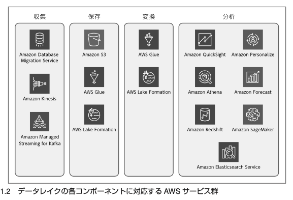

# AWS ではじめるデータレイク

## データレイクの構築

### データウェアハウス

- 分析に必要な粒度を意識して、データウェアハウスの中にデータを保存する
- 分析の前にデータを整理し、使いやすい形に揃え、不要なデータをカットする
  - 目的に合わせてデータが整理されているからこそ、データは分析可能
  - 「目的指向」がデータウェアハウスの重要な特徴
- 一方、DWH は目的に特化したデータしか保存していないため、新しいニーズへの対応は困難

### Computating と storage の分離

### データレイクを構築する際の考え方

- 「どのようなアウトプットが欲しいか」
  - データが生み出されてから意思決定をするまでにどれだけの時間を許容するか
  - 意思決定のためにデータをどれくらいの期間使用するか
- 必要なデータソースをリストアップ
  - データをストリームで受け取る vs. ダンプしたデータを定期的に移動させるか
  - インプットデータをアウトプットデータに変換するために
    - どのような処理
    - 適したツール
    - アーキテクチャ
- データを分析する
  - データそのものを分析
  - 得られた結果どう活用するか
  - 他システムや利用者がどのような形で受け取るか

### データ収集、保存

- データ収集
  - ファイル転送ツール AWS DataSync
  - ストリームデータの収集ツール Amazon KDS
  - データベースに関するサービス Amazon Database Migration Service
    - DB -> S3
- データ保存
  - 基本的に S3

### データカタログ・ETL

- 「どのようにデータが使われるかについて考慮せずに、単純にデータを突っ込んでしまうと、 データレイクがゴミ溜め(garbage dump)になってしまう可能性が高い」
- AWS Glue
  - Data Catalog
    - テーブル定義などの情報など
    - データベース・S3 両方管理可能
    - スキーマの変更管理
  - ETL
- AWS Lake Formation
  - Glue + 権限管理部分の機能
    - GRANT 文の記法で一元管理
  - Blueprint 典型的な ETL 処理のテンプレート集
- その他のサービス

  - Amazon Elastice Mapreduce 　大規模なデータを処理する場合
  - AWS Lambda データが小規模な場合
  - Amazon Athena SQL ベースの加工整形

- 典型的な変換処理
  - 日付に関わる処理:西暦/和暦などの表の示形式の変更や、JST から UTC
  - 不正な値の処理:Null 値や空っぽの値の変換など
  - 文字列や値の統一:大文字小文字の統一、整数/小数の統一、表記の揺れの統一など
  - テーブルの結合処理:取引ログテーブルと取引先テーブルを取引先 ID で結合など
  - ファイルサイズの変換:大量の細かい数 KB 程度のファイルを、数百 MB のファイルに集約など
  - ファイルフォーマットの変換:Parquet/ORC への変換
